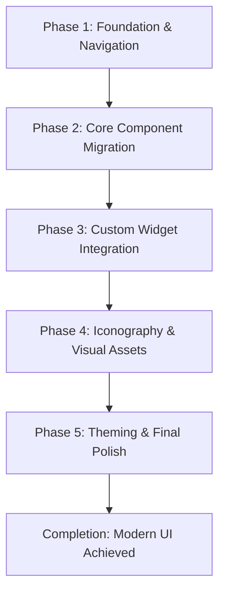

### **Project Overhaul Plan: HomeUnitCalculator Fluent UI**

This plan outlines the process of migrating the application from standard `PyQt5` widgets to a modern, fluid interface using `qfluentwidgets`, while ensuring all existing functionality is preserved.

#### **High-Level Strategy**

We will follow a phased approach to ensure a smooth and manageable transition.

---

### **Phase 1: Foundation & Navigation**

**Goal:** Replace the main window's `QTabWidget` with the `qfluentwidgets.NavigationView` for a modern sidebar-based navigation experience.

**File to Modify:** `src/core/HomeUnitCalculator.py`

**Steps:**

1.  **Replace `QTabWidget`:**
    *   Remove the existing `QTabWidget` instance.
    *   Create a `qfluentwidgets.NavigationView` as the main navigation element.
2.  **Populate Navigation:**
    *   Add each existing tab as a "sub-interface" to the `NavigationView`.
    *   Assign appropriate icons and clear labels for each navigation item (e.g., "Main Calculation", "Room Calculations", "History").
3.  **Update Layout:**
    *   Set the `NavigationView` as the central widget of the `QMainWindow`.
4.  **Adapt Button Visibility Logic:**
    *   Modify the `update_save_buttons_visibility` method to work with the `NavigationView`'s selection-changed signals instead of the `QTabWidget`'s index.

---

### **Phase 2: Core Component Migration**

**Goal:** Systematically replace standard `PyQt5` widgets with their `qfluentwidgets` counterparts across all UI tabs.

**Files to Modify:** All files within `src/ui/tabs/`

**Widget Mapping:**

| Standard Widget (`PyQt5`) | Fluent Widget (`qfluentwidgets`)                 | Notes                                                              |
| ------------------------- | ------------------------------------------------ | ------------------------------------------------------------------ |
| `QGroupBox`               | `CardWidget`                                     | Provides better visual grouping and a modern card-based look.      |
| `QLabel`                  | `TitleLabel`, `BodyLabel`, `CaptionLabel`        | Use different label types for a clear visual hierarchy.            |
| `QPushButton`             | `PrimaryPushButton`, `PushButton`                | Use `PrimaryPushButton` for key actions like "Calculate".          |
| `QComboBox`               | `ComboBox`                                       | A direct, modern replacement.                                      |
| `QSpinBox`                | `SpinBox`                                        | A direct, modern replacement.                                      |
| `QScrollArea`             | `ScrollArea`                                     | Provides themed scrollbars that match the Fluent design.           |

---

### **Phase 3: Custom Widget Integration**

**Goal:** Adapt or replace the application's custom widgets to align with the Fluent design system.

**Files to Modify:** `src/ui/custom_widgets.py` and its dependent files.

**Adaptation Plan:**

1.  **`CustomLineEdit`:**
    *   **Action:** Create a new `FluentLineEdit` class that inherits from `qfluentwidgets.LineEdit`.
    *   **Reason:** This will preserve the essential custom keyboard navigation logic (`Up`, `Down`, `Enter` for focus changes) while adopting the Fluent visual style automatically.
2.  **`CustomSpinBox`:**
    *   **Action:** Replace completely with `qfluentwidgets.SpinBox`.
    *   **Reason:** The fluent version is a superior replacement, and the custom painting logic in `CustomSpinBox` will no longer be necessary.
3.  **`CustomNavButton`:**
    *   **Action:** Replace with `qfluentwidgets.PrimaryPushButton`.
    *   **Reason:** This is a direct replacement for the primary action button. The custom focus navigation logic will be re-evaluated and likely simplified by the natural focus chain of the new layout.
4.  **`AutoScrollArea`:**
    *   **Action:** Modify `AutoScrollArea` to inherit from `qfluentwidgets.ScrollArea` instead of `QScrollArea`.
    *   **Reason:** This will give us the modern, fluent-styled scrollbars while retaining the unique and valuable features of auto-scrolling and Ctrl-wheel zooming.

---

### **Phase 4: Iconography & Visual Assets**

**Goal:** Establish a consistent and modern set of icons for the application and generate a new application icon.

**1. Application Icon Design Prompt:**

I will use the following detailed prompt to generate a new application icon that matches the modernized UI:

> "Create a minimalist and modern application icon for a desktop software called 'Home Unit Calculator'. The design must adhere to Fluent Design principles. The icon should be a stylized, abstract representation of a house combined with a calculator symbol or a subtle energy/power motif (like a leaf or a simple lightning bolt). Use a clean, friendly color palette dominated by a soft blue (#0078D4) and slate gray, with a small, vibrant green accent (#107C10) to signify efficiency. The icon should be a vector graphic, enclosed within a 'squircle' shape, with soft shadows to give it a slight depth. It must be clear and recognizable at small sizes."

**2. UI Icon List:**

We will use the built-in `qfluentwidgets.FluentIcon` enum for all in-app icons to ensure consistency and quality.

| UI Element                   | Current Icon (`.png`)   | Proposed `FluentIcon`          |
| -------------------------- | ----------------------- | ------------------------------ |
| **App Icon**               | `icon.png`              | *(Generated from prompt above)*|
| **Navigation**             |                         |                                |
| Main Calculation           | -                       | `FluentIcon.HOME`              |
| Room Calculations          | -                       | `FluentIcon.BEDROOM`           |
| Calculation History        | -                       | `FluentIcon.HISTORY`           |
| Rental Info                | -                       | `FluentIcon.PEOPLE`            |
| Archived Info              | -                       | `FluentIcon.ARCHIVE`           |
| Supabase Config            | -                       | `FluentIcon.SETTINGS`          |
| **Actions**                |                         |                                |
| Calculate                  | `calculate_icon.png`    | `FluentIcon.CALCULATOR`        |
| Save as PDF / CSV          | `save_icon.png`         | `FluentIcon.SAVE`              |
| Save to Cloud              | `database_icon.png`     | `FluentIcon.CLOUD_DOWNLOAD`    |
| Load from PC / Cloud       | -                       | `FluentIcon.FOLDER_OPEN`       |

---

### **Phase 5: Theming & Final Polish**

**Goal:** Unify the application's styling under the `qfluentwidgets` theming system and remove legacy styling code.

**Steps:**

1.  **Implement Theming:**
    *   In `src/core/HomeUnitCalculator.py`, explicitly set a global theme (e.g., `Theme.LIGHT`) for the entire application. This will ensure all fluent widgets are styled consistently.
2.  **Remove Legacy Styles:**
    *   Delete the `src/ui/styles.py` file.
    *   Remove all calls to `get_stylesheet()`, `get_group_box_style()`, etc., from the codebase.
3.  **Final Review:**
    *   Perform a final visual review of the entire application to check for any inconsistencies in layout, spacing, or typography and make final adjustments.